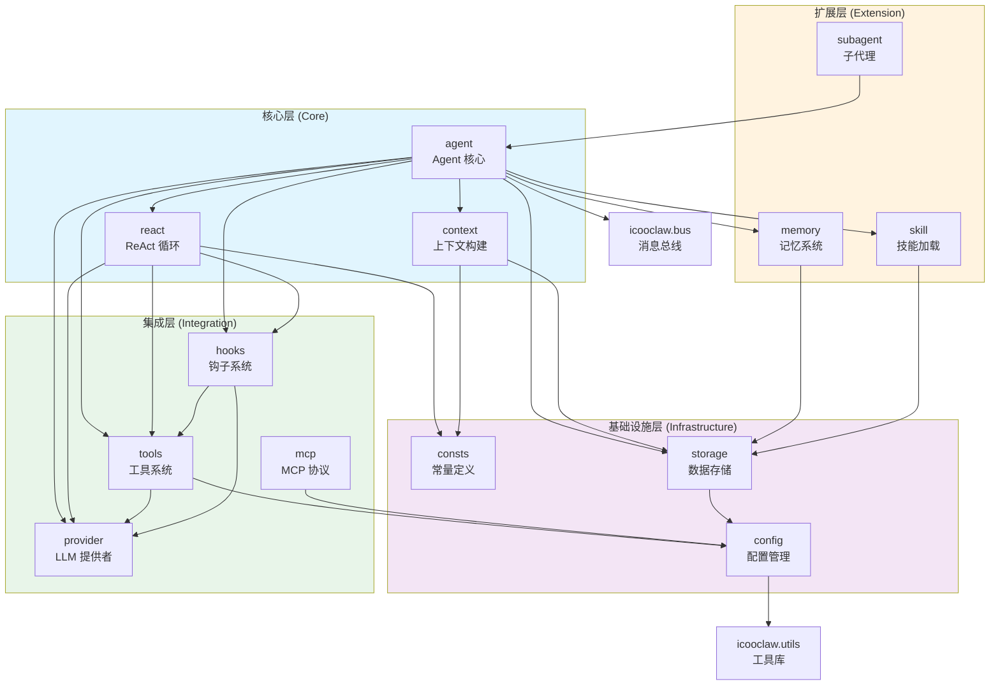
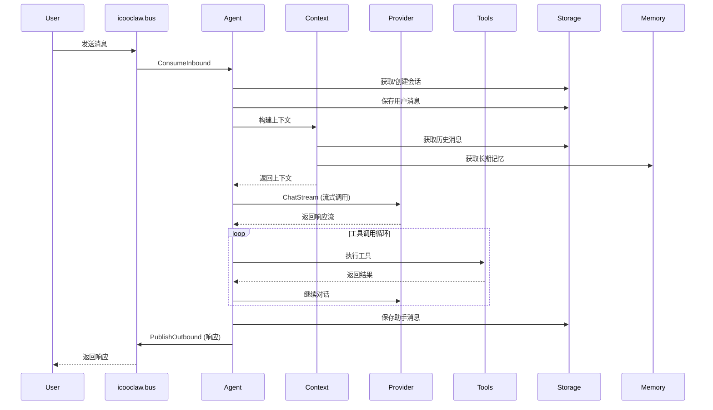

# icooclaw.ai 模块架构文档

## 概述

`icooclaw.ai` 是一个 AI Agent 框架的核心模块，提供了完整的 Agent 运行时环境，包括 LLM 提供者集成、工具管理、记忆系统、技能加载等功能。

## 模块架构图



## 模块说明

### 核心层 (Core)

| 模块 | 文件 | 职责 |
|------|------|------|
| `agent` | `agent/agent.go` | Agent 核心实现，管理 Agent 生命周期、消息处理、工具注册 |
| `react` | `agent/react.go` | ReAct (Reasoning + Acting) 循环实现，处理 LLM 交互和工具调用 |
| `context` | `agent/context.go` | 上下文构建器，组装系统提示词、历史消息、记忆等上下文信息 |

### 基础设施层 (Infrastructure)

| 模块 | 文件 | 职责 |
|------|------|------|
| `config` | `config/config.go` | 配置加载和管理，支持 TOML 格式配置文件 |
| `consts` | `consts/consts.go` | 全局常量定义，如角色类型枚举 |
| `storage` | `storage/` | 数据持久化层，使用 GORM + SQLite 存储会话、消息、记忆等数据 |

### 集成层 (Integration)

| 模块 | 文件 | 职责 |
|------|------|------|
| `provider` | `provider/` | LLM 提供者抽象和实现，支持 OpenAI、DeepSeek、Anthropic 等 |
| `tools` | `tools/` | 工具注册和执行系统，支持内置工具和 JS 扩展工具 |
| `mcp` | `mcp/` | Model Context Protocol 集成，支持外部工具服务器 |
| `hooks` | `hooks/` | 钩子接口定义，用于在 Agent 循环的各个阶段注入自定义逻辑 |

### 扩展层 (Extension)

| 模块 | 文件 | 职责 |
|------|------|------|
| `memory` | `memory/` | 长期记忆系统，支持记忆存储、检索、整合和清理 |
| `skill` | `skill/` | 技能加载器，从数据库或文件加载预定义的技能提示词 |
| `subagent` | `subagent/` | 子代理管理器，支持后台运行定时任务的子 Agent |

## 依赖关系详解

### 1. agent 模块依赖

```
agent
├── provider   # 调用 LLM API
├── tools      # 执行工具调用
├── storage    # 持久化会话和消息
├── memory     # 管理长期记忆
├── skill      # 加载技能提示词
├── hooks      # 注入生命周期钩子
├── consts     # 使用常量定义
└── icooclaw.bus  # 消息总线通信
```

### 2. react 模块依赖

```
react
├── provider   # LLM 流式调用
├── tools      # 工具执行
├── hooks      # 生命周期回调
├── consts     # 角色类型常量
└── storage    # 会话管理
```

### 3. tools 模块依赖

```
tools
├── config     # 工具配置
├── provider   # 工具定义类型共享
└── [外部库]
    ├── goja   # JavaScript 运行时
    └── mark3labs/mcp-go  # MCP SDK
```

### 4. memory 模块依赖

```
memory
└── storage    # 记忆持久化
```

### 5. mcp 模块依赖

```
mcp
├── config     # MCP 服务器配置
└── tools      # 注册 MCP 工具
```

## 数据流图



## 接口设计

### Provider 接口

```go
type Provider interface {
    Chat(ctx context.Context, req ChatRequest) (*ChatResponse, error)
    ChatStream(ctx context.Context, req ChatRequest, callback StreamCallback) error
    GetDefaultModel() string
    GetName() string
}
```

### Tool 接口

```go
type Tool interface {
    Name() string
    Description() string
    Parameters() map[string]interface{}
    Execute(ctx context.Context, params map[string]interface{}) (string, error)
    ToDefinition() ToolDefinition
}
```

### ReActHooks 接口

```go
type ReActHooks interface {
    OnLLMRequest(ctx context.Context, req *provider.ChatRequest, iteration int) error
    OnLLMChunk(ctx context.Context, content, thinking string) error
    OnLLMResponse(ctx context.Context, content, reasoningContent string, toolCalls []provider.ToolCall, iteration int) error
    OnToolCall(ctx context.Context, toolCallID string, toolName string, arguments string) error
    OnToolResult(ctx context.Context, toolCallID string, toolName string, result tools.ToolResult) error
    OnIterationStart(ctx context.Context, iteration int, messages []provider.Message) error
    OnIterationEnd(ctx context.Context, iteration int, hasToolCalls bool) error
    OnError(ctx context.Context, err error) error
    OnComplete(ctx context.Context, content, reasoningContent string, toolCalls []provider.ToolCall, iterations int) error
}
```

## 模块职责边界

### agent 模块
- **负责**: Agent 生命周期管理、消息路由、工具注册
- **不负责**: LLM API 细节、数据持久化具体实现

### provider 模块
- **负责**: LLM API 调用、响应解析、流式处理
- **不负责**: 消息存储、上下文构建

### tools 模块
- **负责**: 工具注册、执行、参数验证
- **不负责**: 工具调用决策（由 Agent 决定）

### memory 模块
- **负责**: 记忆存储、检索、整合
- **不负责**: 上下文组装（由 Context 负责）

### storage 模块
- **负责**: 数据持久化、查询
- **不负责**: 业务逻辑

## 扩展指南

### 添加新的 LLM Provider

1. 在 `provider/` 目录下创建新文件（如 `newprovider.go`）
2. 实现 `Provider` 接口
3. 在 `provider/registry.go` 中注册

### 添加新工具

1. 在 `tools/` 目录下创建新文件
2. 实现 `Tool` 接口
3. 在 `tools/init.go` 中注册

### 添加新技能

1. 在数据库 `skills` 表中添加记录
2. 或在 `skill/builtin.go` 中添加内置技能

## 版本信息

- Go 版本: 1.24.11
- 主要依赖:
  - `gorm.io/gorm` - ORM
  - `github.com/dop251/goja` - JavaScript 运行时
  - `github.com/mark3labs/mcp-go` - MCP SDK
  - `github.com/spf13/viper` - 配置管理