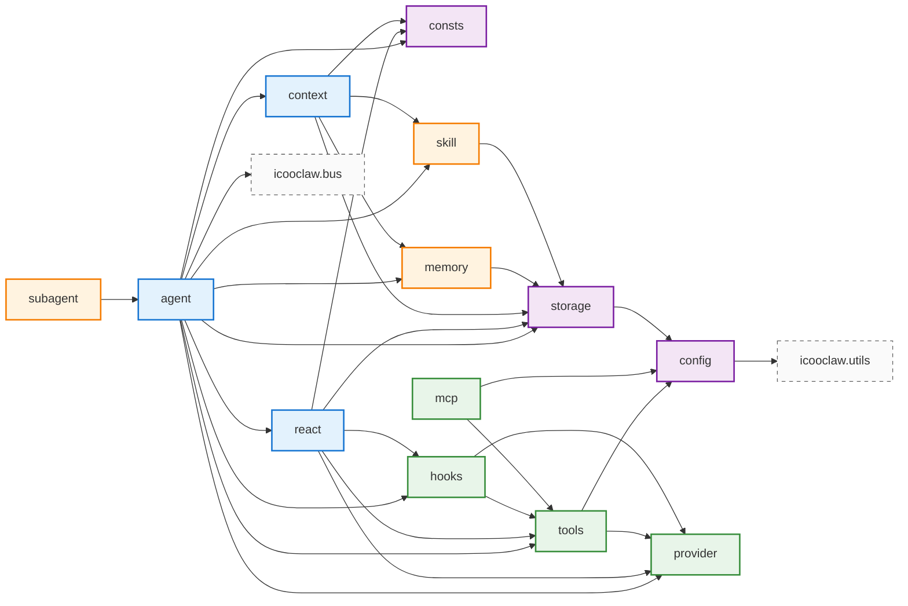
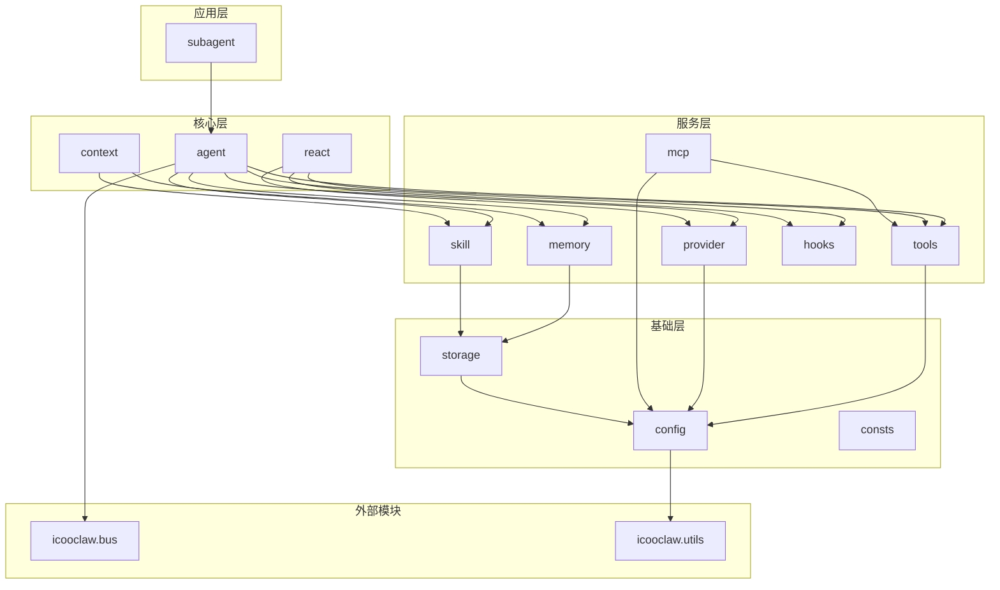

# 模块依赖关系图

## 完整依赖图



## 分层依赖图



## 模块依赖矩阵

| 模块 | agent | react | context | config | consts | storage | provider | tools | mcp | hooks | memory | skill | subagent |
|------|:-----:|:-----:|:-------:|:------:|:------:|:-------:|:--------:|:-----:|:---:|:-----:|:------:|:-----:|:--------:|
| agent | - | ✅ | ✅ | ❌ | ✅ | ✅ | ✅ | ✅ | ❌ | ✅ | ✅ | ✅ | ❌ |
| react | ❌ | - | ❌ | ❌ | ✅ | ✅ | ✅ | ✅ | ❌ | ✅ | ❌ | ❌ | ❌ |
| context | ❌ | ❌ | - | ❌ | ✅ | ✅ | ❌ | ❌ | ❌ | ❌ | ✅ | ✅ | ❌ |
| config | ❌ | ❌ | ❌ | - | ❌ | ❌ | ❌ | ❌ | ❌ | ❌ | ❌ | ❌ | ❌ |
| consts | ❌ | ❌ | ❌ | ❌ | - | ❌ | ❌ | ❌ | ❌ | ❌ | ❌ | ❌ | ❌ |
| storage | ❌ | ❌ | ❌ | ✅ | ❌ | - | ❌ | ❌ | ❌ | ❌ | ❌ | ❌ | ❌ |
| provider | ❌ | ❌ | ❌ | ❌ | ❌ | ❌ | - | ❌ | ❌ | ❌ | ❌ | ❌ | ❌ |
| tools | ❌ | ❌ | ❌ | ✅ | ❌ | ❌ | ✅ | - | ❌ | ❌ | ❌ | ❌ | ❌ |
| mcp | ❌ | ❌ | ❌ | ✅ | ❌ | ❌ | ❌ | ✅ | - | ❌ | ❌ | ❌ | ❌ |
| hooks | ❌ | ❌ | ❌ | ❌ | ❌ | ❌ | ✅ | ✅ | ❌ | - | ❌ | ❌ | ❌ |
| memory | ❌ | ❌ | ❌ | ❌ | ❌ | ✅ | ❌ | ❌ | ❌ | ❌ | - | ❌ | ❌ |
| skill | ❌ | ❌ | ❌ | ❌ | ❌ | ✅ | ❌ | ❌ | ❌ | ❌ | ❌ | - | ❌ |
| subagent | ✅ | ❌ | ❌ | ❌ | ❌ | ❌ | ❌ | ❌ | ❌ | ❌ | ❌ | ❌ | - |

## 循环依赖检查

当前模块依赖关系**无循环依赖**。依赖关系为有向无环图 (DAG)。

```
依赖深度:
- Level 0: consts, bus, utils (外部依赖)
- Level 1: config
- Level 2: storage, provider
- Level 3: tools, hooks, memory, skill, mcp
- Level 4: react, context
- Level 5: agent
- Level 6: subagent
```

## 外部依赖

### Go 标准库
- `context` - 上下文管理
- `encoding/json` - JSON 序列化
- `fmt` - 格式化输出
- `log/slog` - 结构化日志
- `net/http` - HTTP 客户端
- `os` - 文件系统操作
- `path/filepath` - 路径处理
- `sync` - 并发原语
- `time` - 时间处理

### 第三方库
| 库 | 版本 | 用途 | 使用模块 |
|---|------|------|---------|
| `gorm.io/gorm` | v1.31.1 | ORM | storage |
| `github.com/glebarez/sqlite` | v1.21.2 | SQLite 驱动 | storage |
| `github.com/spf13/viper` | v1.21.0 | 配置管理 | config |
| `github.com/dop251/goja` | v0.0.0-20260226184354-913bd86fb70c | JS 运行时 | tools |
| `github.com/mark3labs/mcp-go` | v0.44.1 | MCP SDK | mcp |
| `github.com/stretchr/testify` | v1.11.1 | 测试框架 | 全局 |

### 内部模块依赖
| 模块 | 依赖 |
|------|------|
| icooclaw.ai | icooclaw.bus |
| icooclaw.ai | icooclaw.utils |