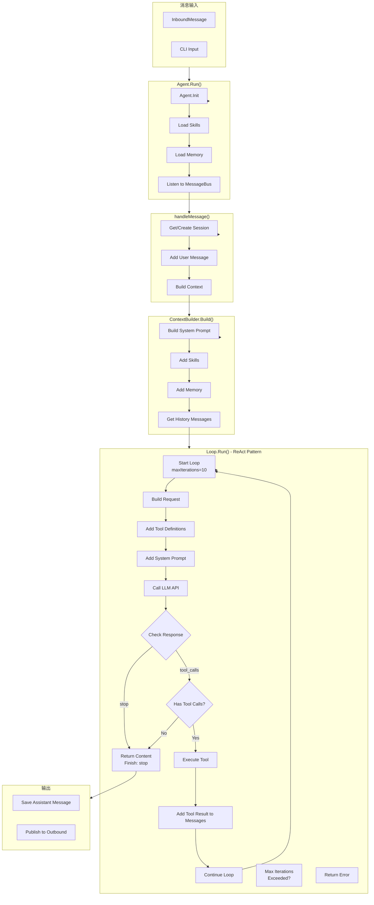
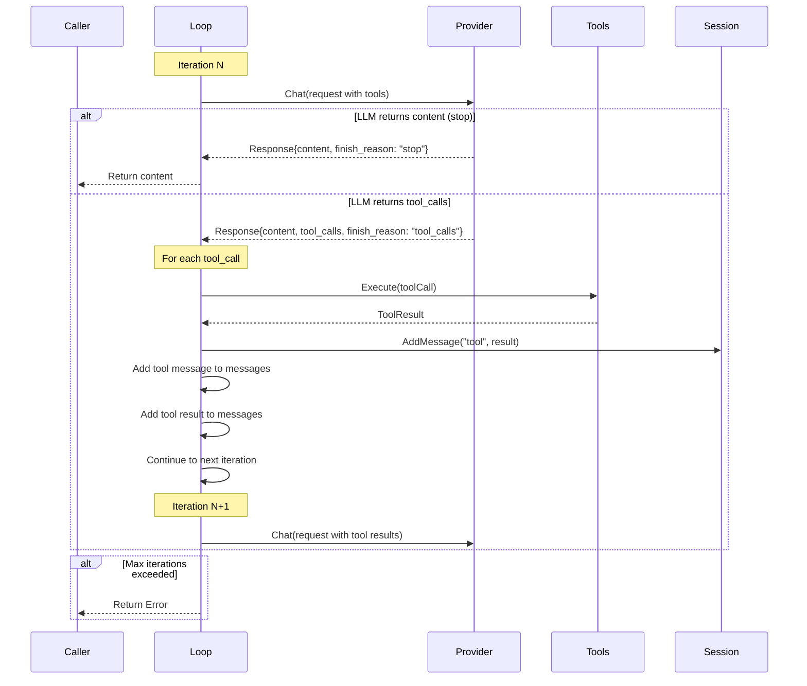
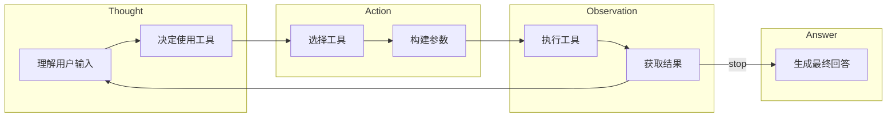
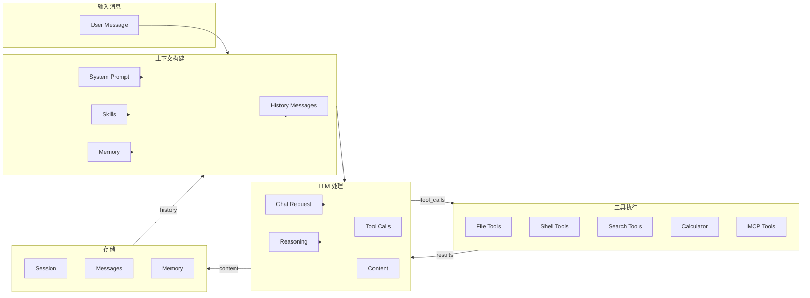
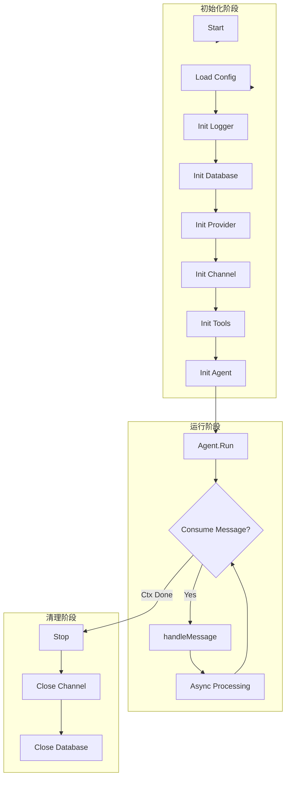

# Agent Loop 运行图

## Agent Loop 完整流程

```mermaid
flowchart TB
    subgraph Input["消息输入"]
        inbound[InboundMessage]
        cli[CLI Input]
    end
    
    subgraph AgentRun["Agent.Run()"]
        init[Agent.Init]
        load_skills[Load Skills]
        load_memory[Load Memory]
        listen[Listen to MessageBus]
    end
    
    subgraph HandleMessage["handleMessage()"]
        get_session[Get/Create Session]
        add_user_msg[Add User Message]
        build_ctx[Build Context]
    end
    
    subgraph ContextBuilder["ContextBuilder.Build()"]
        sys_prompt[Build System Prompt]
        skills_prompt[Add Skills]
        memory_prompt[Add Memory]
        history[Get History Messages]
    end
    
    subgraph Loop["Loop.Run() - ReAct Pattern"]
        start_loop[Start Loop<br/>maxIterations=10]
        
        build_req[Build Request]
        add_tools[Add Tool Definitions]
        add_system[Add System Prompt]
        call_llm[Call LLM API]
        
        check_resp{Check Response}
        stop[Return Content<br/>Finish: stop]
        
        check_tools{Has Tool Calls?}
        execute_tool[Execute Tool]
        add_result[Add Tool Result to Messages]
        continue[Continue Loop]
        
        max_iter[Max Iterations<br/>Exceeded?]
        error[Return Error]
    end
    
    subgraph Output["输出"]
        save_resp[Save Assistant Message]
        publish[Publish to Outbound]
    end
    
    Input --> AgentRun
    AgentRun --> init --> load_skills --> load_memory --> listen
    listen --> HandleMessage
    HandleMessage --> get_session --> add_user_msg --> build_ctx
    build_ctx --> ContextBuilder
    ContextBuilder --> sys_prompt --> skills_prompt --> memory_prompt --> history
    
    history --> Loop
    Loop --> start_loop
    start_loop --> build_req --> add_tools --> add_system --> call_llm
    call_llm --> check_resp
    
    check_resp -->|stop| stop
    check_resp -->|tool_calls| check_tools
    
    check_tools -->|Yes| execute_tool --> add_result --> continue
    check_tools -->|No| stop
    
    continue --> start_loop
    
    stop --> Output
```

## Agent Loop 迭代时序图

```mermaid
sequenceDiagram
    participant C as Caller
    participant L as Loop
    participant P as Provider
    participant T as Tools
    participant S as Session

    Note over L: Iteration N
    L->>P: Chat(request with tools)
    
    alt LLM returns content (stop)
        P-->>L: Response{content, finish_reason: "stop"}
        L-->>C: Return content
    else LLM returns tool_calls
        P-->>L: Response{content, tool_calls, finish_reason: "tool_calls"}
        
        Note over L: For each tool_call
        L->>T: Execute(toolCall)
        T-->>L: ToolResult
        
        L->>S: AddMessage("tool", result)
        
        L->>L: Add tool message to messages
        L->>L: Add tool result to messages
        L->>L: Continue to next iteration
        
        Note over L: Iteration N+1
        L->>P: Chat(request with tool results)
    end
    
    alt Max iterations exceeded
        L-->>C: Return Error
    end
```

## ReAct 模式图

```mermaid
flowchart LR
    subgraph Thought["Thought"]
        T1[理解用户输入]
        T2[决定使用工具]
    end
    
    subgraph Action["Action"]
        A1[选择工具]
        A2[构建参数]
    end
    
    subgraph Observe["Observation"]
        O1[执行工具]
        O2[获取结果]
    end
    
    subgraph Answer["Answer"]
        Ans[生成最终回答]
    end
    
    T1 --> T2 --> A1 --> A2 --> O1 --> O2 --> T1
    O2 -->|stop| Ans
```

## 消息流转图

```mermaid
flowchart LR
    subgraph Input["输入消息"]
        user[User Message]
    end
    
    subgraph Context["上下文构建"]
        sys[System Prompt]
        skills[Skills]
        memory[Memory]
        history[History Messages]
    end
    
    subgraph LLM["LLM 处理"]
        request[Chat Request]
        reasoning[Reasoning]
        tool_calls[Tool Calls]
        content[Content]
    end
    
    subgraph Tools["工具执行"]
        file[File Tools]
        shell[Shell Tools]
        search[Search Tools]
        calc[Calculator]
        mcp[MCP Tools]
    end
    
    subgraph Storage["存储"]
        session[Session]
        messages[Messages]
        mem[Memory]
    end
    
    user --> Context
    sys --> Context
    skills --> Context
    memory --> Context
    history --> Context
    
    Context --> LLM
    request --> LLM
    reasoning --> LLM
    
    LLM -->|tool_calls| Tools
    Tools -->|results| LLM
    LLM -->|content| Storage
    Storage -->|history| Context
```

## Agent 启动流程

```mermaid
flowchart TB
    subgraph Init["初始化阶段"]
        start[Start]
        load_cfg[Load Config]
        init_logger[Init Logger]
        init_db[Init Database]
        init_provider[Init Provider]
        init_channel[Init Channel]
        init_tools[Init Tools]
        init_agent[Init Agent]
    end
    
    subgraph Run["运行阶段"]
        agent_run[Agent.Run]
        consume{Consume Message?}
        handle[handleMessage]
        async[Async Processing]
    end
    
    subgraph Cleanup["清理阶段"]
        stop[Stop]
        close_db[Close Database]
        close_channel[Close Channel]
    end
    
    start --> Init
    Init --> load_cfg --> init_logger --> init_db --> init_provider --> init_channel --> init_tools --> init_agent
    init_agent --> agent_run
    agent_run --> consume
    consume -->|Yes| handle --> async
    async --> consume
    consume -->|Ctx Done| stop --> close_channel --> close_db
```
