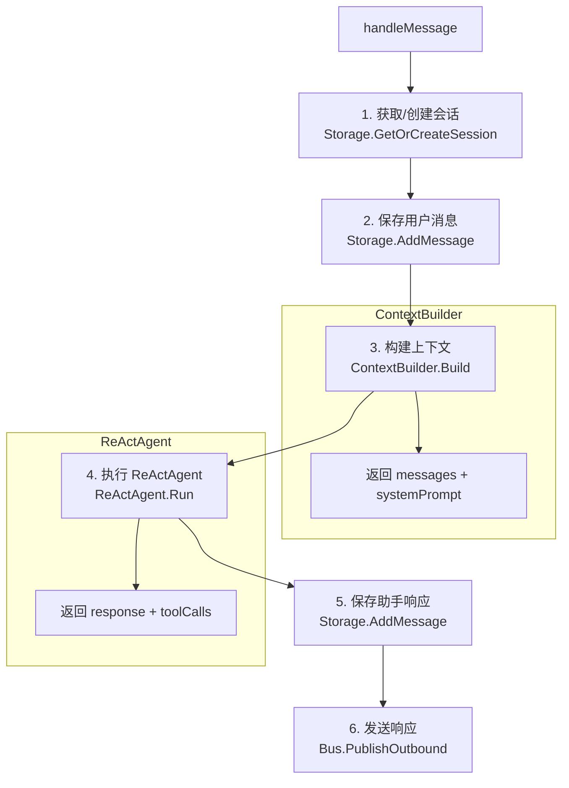
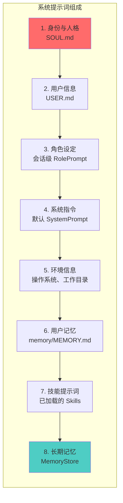
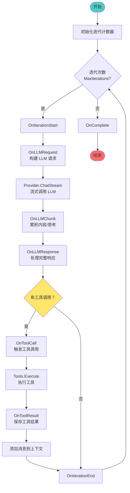
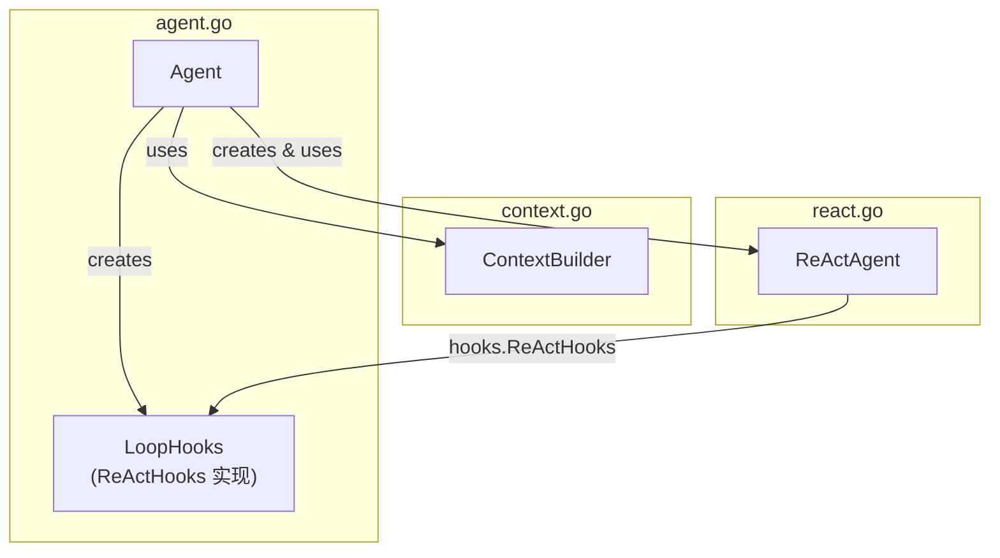
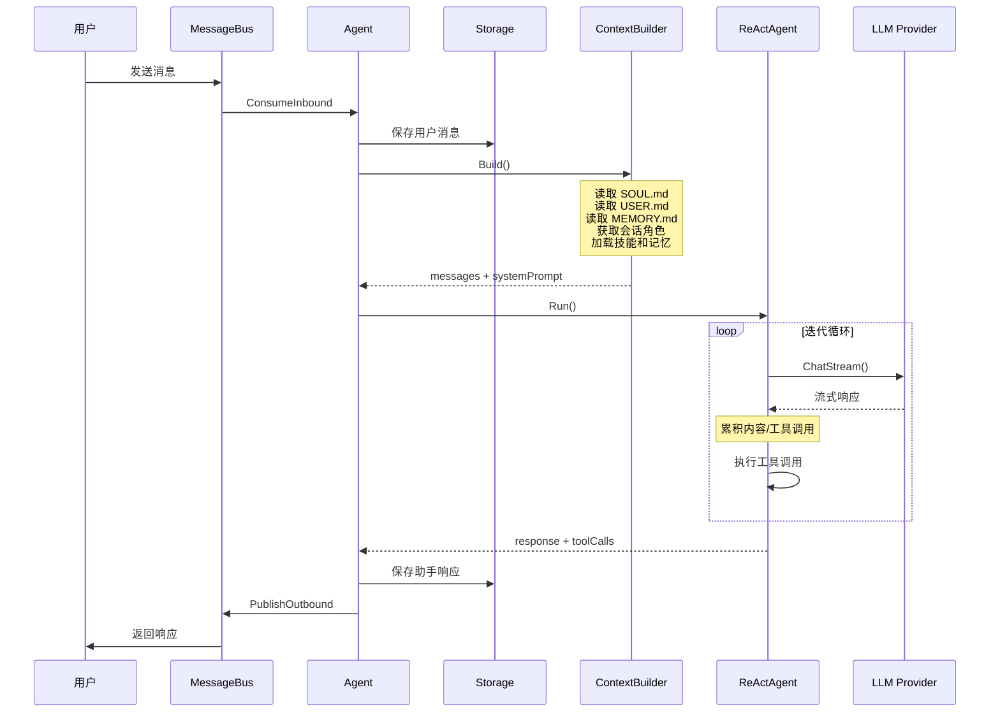

# Agent 模块分析文档

**文件位置**: `agent/icooclaw.ai/agent/`  
**更新日期**: 2026 年 3 月 2 日

---

## 一、模块概览

### 1.1 文件结构

```
agent/icooclaw.ai/agent/
├── agent.go          # 核心 Agent 逻辑
├── context.go        # 上下文构建器
├── react.go          # ReAct 模式 Agent 实现
└── context_test.go   # 测试文件
```

### 1.2 模块职责

| 模块 | 文件 | 核心职责 |
|------|------|----------|
| **Agent** | `agent.go` | 协调整个 AI 助手的核心组件，处理消息循环、会话管理、工具注册 |
| **ContextBuilder** | `context.go` | 构建 LLM 请求的完整上下文（系统提示词 + 消息历史） |
| **ReActAgent** | `react.go` | 实现 ReAct (Reasoning + Acting) 模式，处理多轮 LLM 交互循环 |
| **LoopHooks** | `agent.go` | 实现钩子接口，处理 LLM 交互过程中的事件回调 |

---

## 二、详细模块分析

### 2.1 Agent 模块 (`agent.go`)

#### 核心结构体

```go
// SessionMetadata - 会话元数据
type SessionMetadata struct {
    RolePrompt string  // 会话级角色提示词
}

// Agent - 核心 Agent 结构体
type Agent struct {
    name      string
    provider  provider.Provider   // LLM 提供者
    tools     *tools.Registry     // 工具注册表
    storage   *storage.Storage    // 存储系统
    memory    *memory.MemoryStore // 长期记忆存储
    skills    *skill.Loader       // 技能加载器
    config    config.AgentSettings
    bus       *icooclawbus.MessageBus // 消息总线
    logger    *slog.Logger
    workspace string
}

// LoopHooks - ReAct 钩子实现
type LoopHooks struct {
    // 实现 hooks.ReActHooks 接口
}
```

#### 核心方法

| 方法 | 签名 | 功能描述 |
|------|------|----------|
| `NewAgent` | `func NewAgent(...) (*Agent, error)` | 创建并初始化 Agent 实例 |
| `Run` | `func (a *Agent) Run(ctx context.Context) error` | 启动 Agent 主循环，监听消息总线 |
| `handleMessage` | `func (a *Agent) handleMessage(ctx context.Context, msg icooclawbus.InboundMessage)` | 处理单条用户消息的核心逻辑 |
| `ProcessMessage` | `func (a *Agent) ProcessMessage(ctx context.Context, content string, sessionID string) (string, error)` | 直接处理消息（CLI 模式） |
| `Init` | `func (a *Agent) Init(ctx context.Context) error` | 初始化技能和记忆 |
| `RegisterTool` | `func (a *Agent) RegisterTool(tool tools.Tool)` | 注册工具到工具注册表 |
| `SetSessionRolePrompt` | `func (a *Agent) SetSessionRolePrompt(sessionID, rolePrompt string)` | 设置会话角色提示词 |
| `GetSessionRolePrompt` | `func (a *Agent) GetSessionRolePrompt(sessionID) string` | 获取会话角色提示词 |
| `UpdateMemoryFile` | `func (a *Agent) UpdateMemoryFile(content string)` | 更新记忆文件 |
| `GetMemoryFile` | `func (a *Agent) GetMemoryFile() string` | 获取记忆文件内容 |

#### 消息处理流程



---

### 2.2 ContextBuilder 模块 (`context.go`)

#### 核心结构体

```go
// ContextBuilder - 上下文构建器
type ContextBuilder struct {
    sessionID      string
    provider       provider.Provider
    storage        *storage.Storage
    memory         *memory.MemoryStore
    skills         *skill.Loader
    config         config.AgentSettings
    rolePrompt     string  // 会话级角色提示词
    userPrompt     string  // 用户偏好 (USER.md)
    soulPrompt     string  // 身份人格 (SOUL.md)
    memoryContent  string  // 记忆文件 (MEMORY.md)
    workspace      string
}
```

#### 系统提示词组成（优先级从高到低）



#### 核心方法

| 方法 | 功能描述 |
|------|----------|
| `NewContextBuilder` | 创建上下文构建器实例 |
| `Build` | 构建完整的上下文（返回 messages 和 systemPrompt） |
| `buildSystemPrompt` | 按优先级组装系统提示词 |
| `buildMessages` | 构建历史消息列表（从存储中读取） |
| `readTemplateFile` | 读取模板文件（SOUL.md, USER.md） |
| `readMemoryFile` | 读取记忆文件（memory/MEMORY.md） |
| `CheckUserPreferenceSet` | 检查用户是否已设置偏好 |

---

### 2.3 ReActAgent 模块 (`react.go`)

#### 核心结构体

```go
// ReActConfig - ReAct Agent 配置
type ReActConfig struct {
    MaxIterations int  // 最大迭代次数（防止无限循环）
}

// ReActAgent - ReAct 模式 Agent 实现
type ReActAgent struct {
    name       string
    provider   provider.Provider
    tools      *tools.Registry
    config     *ReActConfig
    hooks      hooks.ReActHooks  // 钩子接口
    logger     *slog.Logger
}
```

#### ReAct 循环流程



#### 核心方法

| 方法 | 功能描述 |
|------|----------|
| `NewReActConfig` | 创建默认 ReAct 配置 |
| `NewReActAgent` | 创建 ReAct Agent 实例 |
| `Run` | 执行 ReAct 循环，返回最终响应 |
| `createStreamCallback` | 创建流式回调函数（处理 LLM 流式输出） |
| `buildRequest` | 构建 LLM 请求（包含工具定义） |

---

### 2.4 LoopHooks 模块 (`agent.go`)

#### 实现的接口

`LoopHooks` 实现了 `hooks.ReActHooks` 接口的所有方法：

| 钩子方法 | 触发时机 | 功能 |
|----------|----------|------|
| `OnIterationStart` | 每次迭代开始 | 记录迭代开始日志 |
| `OnLLMRequest` | 发送 LLM 请求前 | 保存请求到存储，通过消息总线发送状态 |
| `OnLLMChunk` | 接收 LLM 流式片段 | 通过消息总线发送思考内容和普通内容 |
| `OnLLMResponse` | LLM 响应完成 | 保存响应到存储，发送完成状态 |
| `OnToolCall` | 工具调用开始 | 保存工具调用到存储，发送执行状态 |
| `OnToolResult` | 工具调用完成 | 保存工具结果到存储，发送结果状态 |
| `OnIterationEnd` | 每次迭代结束 | 记录迭代结束日志 |
| `OnError` | 发生错误时 | 记录错误日志，发送错误状态 |
| `OnComplete` | ReAct 循环完成 | 发送最终完成状态 |

---

## 三、模块依赖关系

### 3.1 内部依赖



### 3.2 外部依赖

```
agent 模块依赖的外部包：

┌──────────────────────────────────────────────────────────────┐
│  icooclaw.ai/config      - 配置管理 (AgentSettings)          │
│  icooclaw.ai/consts      - 常量定义                          │
│  icooclaw.ai/hooks       - 钩子接口定义 (ReActHooks)         │
│  icooclaw.ai/memory      - 长期记忆存储 (MemoryStore)        │
│  icooclaw.ai/provider    - LLM 提供者接口 (Provider)         │
│  icooclaw.ai/skill       - 技能加载器 (Loader)               │
│  icooclaw.ai/storage     - 会话和消息存储 (Storage)          │
│  icooclaw.ai/tools       - 工具注册和执行 (Registry, Tool)   │
│  icooclaw.bus            - 消息总线 (MessageBus)             │
│  log/slog                - 标准日志库 (Logger)               │
└──────────────────────────────────────────────────────────────┘
```

---

## 四、架构特点

### 4.1 设计优势

| 特点 | 说明 |
|------|------|
| **分层清晰** | Agent 层 → 功能模块层 → 外部依赖层，职责边界明确 |
| **职责分离** | Agent 负责协调，ContextBuilder 负责上下文，ReActAgent 负责 LLM 交互，LoopHooks 负责事件回调 |
| **可扩展性** | 通过 `ReActHooks` 接口支持自定义行为，无需修改核心代码 |
| **流式处理** | 支持 LLM 流式响应和实时反馈，提升用户体验 |
| **持久化** | 所有消息、工具调用都保存到存储系统，支持会话历史追溯 |
| **模块化** | 各组件通过接口解耦，便于单元测试和模块替换 |

### 4.2 数据流



---

## 五、优化建议

### 5.1 代码层面优化

#### 优先级：高

| 问题 | 建议 | 预期收益 |
|------|------|----------|
| **缺少错误处理** | 在 `handleMessage` 和 `ReActAgent.Run` 中增加更完善的错误处理和重试机制 | 提高系统稳定性 |
| **缺少超时控制** | 为 LLM 调用和工具执行添加超时控制（context.WithTimeout） | 防止长时间阻塞 |
| **内存泄漏风险** | 检查 `streamCallback` 中的闭包引用，确保正确清理 | 避免长期运行时的内存问题 |
| **并发安全** | 为 `SessionMetadata` 的读写添加互斥锁（当前多会话场景可能有问题） | 支持并发会话处理 |

#### 优先级：中

| 问题 | 建议 | 预期收益 |
|------|------|----------|
| **系统提示词过长** | 实现提示词压缩策略，对长历史消息进行摘要 | 减少 token 消耗，提高响应速度 |
| **缺少请求缓存** | 对相同的 LLM 请求添加缓存机制 | 降低 API 调用成本 |
| **工具执行无限制** | 添加工具执行次数限制和速率限制 | 防止恶意或意外的大量调用 |
| **日志级别单一** | 使用不同日志级别（Debug/Info/Warn/Error）区分重要性 | 便于问题排查和性能分析 |

#### 优先级：低

| 问题 | 建议 | 预期收益 |
|------|------|----------|
| **魔法字符串** | 将模板文件名、消息类型等提取为常量 | 提高代码可维护性 |
| **重复代码** | `readTemplateFile` 等方法可以提取为公共工具函数 | 减少代码重复 |
| **缺少指标监控** | 添加 Prometheus 或 OpenTelemetry 指标 | 便于性能监控和告警 |

---

### 5.2 架构层面优化

#### 短期优化（1-2 周）

```
┌─────────────────────────────────────────────────────────────┐
│  1. 添加中间件层                                             │
│     • 请求验证中间件（验证消息格式、权限）                   │
│     • 限流中间件（防止 API 滥用）                            │
│     • 审计中间件（记录关键操作日志）                         │
├─────────────────────────────────────────────────────────────┤
│  2. 改进配置管理                                             │
│     • 支持热重载配置（无需重启）                             │
│     • 添加配置验证（启动时检查配置有效性）                   │
├─────────────────────────────────────────────────────────────┤
│  3. 增强错误处理                                             │
│     • 定义统一的错误类型                                     │
│     • 添加错误恢复策略                                       │
│     • 实现优雅降级机制                                       │
└─────────────────────────────────────────────────────────────┘
```

#### 中期优化（1-2 月）

```
┌─────────────────────────────────────────────────────────────┐
│  1. 引入事件溯源模式                                         │
│     • 将 Agent 状态变化记录为事件序列                        │
│     • 支持状态回滚和重放                                     │
│     • 便于调试和问题追溯                                     │
├─────────────────────────────────────────────────────────────┤
│  2. 实现插件系统                                             │
│     • 定义标准插件接口                                       │
│     • 支持动态加载/卸载插件                                  │
│     • 扩展工具、技能、记忆等能力                             │
├─────────────────────────────────────────────────────────────┤
│  3. 添加性能优化                                             │
│     • 实现上下文缓存（避免重复构建）                         │
│     • 支持增量消息同步                                       │
│     • 优化大文件读取性能                                     │
└─────────────────────────────────────────────────────────────┘
```

#### 长期优化（3-6 月）

```
┌─────────────────────────────────────────────────────────────┐
│  1. 微服务拆分                                               │
│     • 将 Agent、Storage、Memory 拆分为独立服务               │
│     • 通过 gRPC/REST 通信                                    │
│     • 支持水平扩展                                           │
├─────────────────────────────────────────────────────────────┤
│  2. 多 Agent 协作                                            │
│     • 支持多 Agent 并行处理复杂任务                          │
│     • 实现 Agent 间通信协议                                  │
│     • 支持任务分解和分配                                     │
├─────────────────────────────────────────────────────────────┤
│  3. 智能优化                                                 │
│     • 实现自适应迭代次数（根据任务复杂度）                   │
│     • 添加工具调用预测（减少不必要的迭代）                   │
│     • 支持增量学习和反馈优化                                 │
└─────────────────────────────────────────────────────────────┘
```

---

## 六、开发计划建议

### 6.1 第一阶段：稳定性提升（2 周）

```mermaid
gantt
    title 第一阶段：稳定性提升
    dateFormat  X
    axisFormat %s
    
    section 错误处理
    错误处理和重试机制 :a1, 0, 3d
    超时控制 :a2, after a1, 2d
    并发安全保护 :a3, after a2, 2d
    
    section 日志系统
    分级日志系统 :a4, after a3, 2d
    
    section 测试
    单元测试 (80% 覆盖率) :a5, after a4, 3d
```



### 6.2 第二阶段：性能优化（2 周）

```mermaid
gantt
    title 第二阶段：性能优化
    dateFormat  X
    axisFormat %s
    
    section 缓存机制
    上下文缓存 :b1, 0, 3d
    请求去重和缓存 :b2, after b1, 3d
    
    section 工具优化
    工具执行性能优化 :b3, after b2, 2d
    
    section 监控
    性能监控指标 :b4, after b3, 2d
```



### 6.3 第三阶段：功能扩展（4 周）

```mermaid
gantt
    title 第三阶段：功能扩展
    dateFormat  X
    axisFormat %s
    
    section 插件系统
    插件框架实现 :c1, 0, 10d
    
    section 中间件
    中间件系统 :c2, after c1, 5d
    
    section 多 Agent
    多 Agent 原型 :c3, after c2, 5d
```



### 6.4 第四阶段：架构演进（8 周）

```mermaid
gantt
    title 第四阶段：架构演进
    dateFormat  X
    axisFormat %s
    
    section 架构研究
    微服务拆分研究 :d1, 0, 10d
    
    section 事件溯源
    事件溯源实现 :d2, after d1, 15d
    
    section 分布式
    分布式部署支持 :d3, after d2, 15d
```



---

## 七、风险与建议

### 7.1 技术风险

| 风险 | 影响 | 缓解措施 |
|------|------|----------|
| LLM API 不稳定 | 高 | 实现熔断器模式，添加备用 Provider |
| 内存泄漏 | 中 | 定期进行内存分析，添加内存限制 |
| 并发竞争条件 | 中 | 使用 race detector 进行测试 |
| 提示词注入攻击 | 高 | 添加输入验证和输出过滤 |

### 7.2 维护建议

1. **代码审查**: 所有核心模块变更需要至少 1 人审查
2. **变更日志**: 维护详细的 CHANGELOG.md
3. **版本管理**: 遵循语义化版本规范 (SemVer)
4. **文档更新**: 代码变更时同步更新文档
5. **定期重构**: 每季度进行一次技术债务清理

---

## 八、附录

### 8.1 相关文档

- [ReAct 模式论文](https://arxiv.org/abs/2210.03629)
- [Go 最佳实践](https://github.com/golang-standards/project-layout)
- [Clean Architecture](https://blog.cleancoder.com/clean-architecture/)

### 8.2 术语表

| 术语 | 说明 |
|------|------|
| ReAct | Reasoning + Acting，一种结合推理和行动的 LLM 交互模式 |
| Hook | 钩子，在特定时机触发的回调函数 |
| Tool | 工具，Agent 可以调用的外部功能 |
| Skill | 技能，预定义的提示词模板或能力包 |
| Memory | 记忆，长期存储的用户偏好和历史信息 |

---

*本文档由 AI 自动生成，最后更新：2026 年 3 月 2 日*
