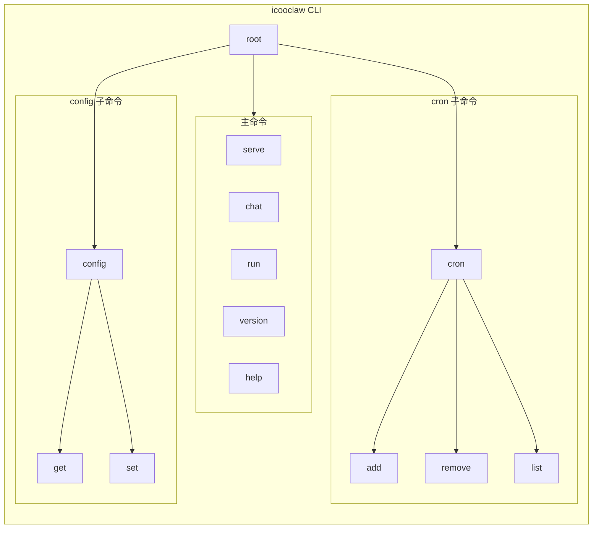
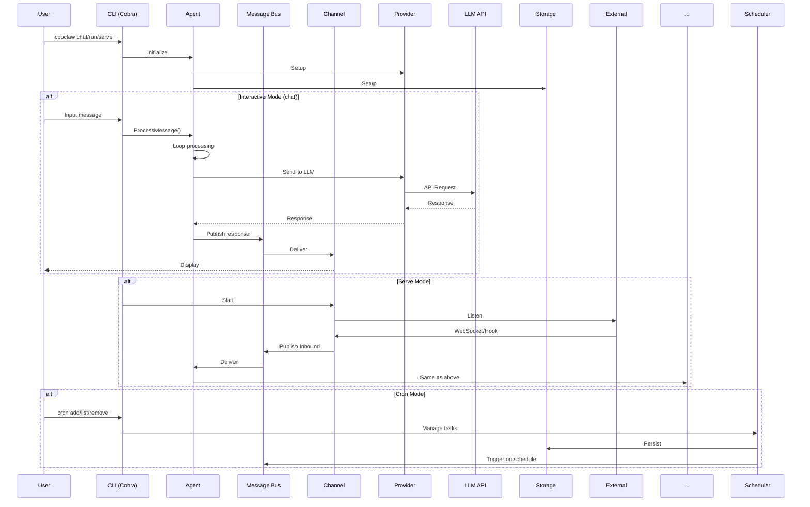

# icooclaw 项目架构图

## 系统架构概览

```mermaid
flowchart TB
    subgraph CLI["CLI 层 (Cobra)"]
        direction TB
        main[main.go]
        
        subgraph Commands["Commands"]
            serve[serve]
            chat[chat]
            run[run]
            cron[cron]
            config[config]
            version[version]
        end
        
        main --> Commands
    end
    
    subgraph Core["Core 层"]
        subgraph Agent["Agent 模块"]
            agent[Agent]
            loop[Loop]
            context[Context]
            memory[Memory]
            skills[Skills]
            subagent[SubAgent]
            tools[Tools Registry]
        end
        
        subgraph Bus["Message Bus"]
            events[Events]
            bus[MessageBus]
        end
        
        subgraph Channel["Channel 模块"]
            ws[WebSocket]
            webhook[Webhook]
            telegram[Telegram]
            discord[Discord]
            feishu[Feishu]
            dingtalk[DingTalk]
            slack[Slack]
            email[Email]
            manager[Channel Manager]
        end
        
        subgraph Config["Config 模块"]
            viper[Viper]
            cfg[Config]
        end
        
        subgraph Provider["Provider 模块"]
            registry[Registry]
            openai[OpenAI]
            anthropic[Anthropic]
            deepseek[DeepSeek]
            openrouter[OpenRouter]
        end
        
        subgraph Scheduler["Scheduler 模块"]
            cron[Scheduler]
            heartbeat[Heartbeat]
        end
        
        subgraph Storage["Storage 模块"]
            db[Database]
            session[Session]
            message[Message]
            task[Task]
            skill[Skill]
            memory[Memory]
        end
        
        subgraph MCP["MCP 模块"]
            mcp_manager[MCP Manager]
            mcp_client[MCP Client]
            mcp_tools[MCPTools]
        end
    end
    
    subgraph External["External"]
        llm[LLM API]
        mcp_servers[MCP Servers]
        external_channels[External Channels]
    end
    
    CLI --> Core
    CLI --> Config
    Config --> Core
    
    Agent --> Bus
    Bus --> Channel
    Channel --> External
    
    Agent --> Provider
    Provider --> llm
    
    Scheduler --> Storage
    Agent --> Storage
    Channel --> Storage
    
    Agent --> MCP
    MCP --> mcp_servers
end
```

## CLI 命令结构



## 消息流处理



## 数据模型

```mermaid
erDiagram
    Session ||--o{ Message : has
    Session ||--o{ Memory : has
    Task ||--o| ChannelConfig : uses
    Skill ||--o| ProviderConfig : uses
    
    Session {
        uint id PK
        string key
        string channel
        string chat_id
        string user_id
        int last_consolidated
        string metadata
    }
    
    Message {
        uint id PK
        uint session_id FK
        string role
        string content
        string tool_calls
        string tool_name
        string reasoning_content
        timestamp
    }
    
    Task {
        uint id PK
        string name
        string description
        string cron_expr
        int interval
        string message
        string channel
        string chat_id
        bool enabled
        timestamp next_run_at
        timestamp last_run_at
    }
    
    Skill {
        uint id PK
        string name
        string description
        string content
        bool enabled
    }
    
    Memory {
        uint id PK
        string session_key
        string role
        string content
        timestamp
    }
```

## 组件交互

```mermaid
flowchart LR
    subgraph Input["输入"]
        repl[REPL Input]
        ws[WebSocket]
        webhook[Webhook]
        cron[Cron Trigger]
    end
    
    subgraph Processing["处理"]
        agent[Agent]
        tools[Tools]
        provider[Provider]
        mcp[MCP]
    end
    
    subgraph Output["输出"]
        repl_out[REPL Output]
        ws_out[WebSocket]
        webhook_out[Webhook Response]
        storage[Storage]
    end
    
    Input --> Processing
    Processing --> Output
    
    repl --> agent
    ws --> agent
    webhook --> agent
    cron --> agent
    
    agent --> tools
    agent --> provider
    agent --> mcp
    
    repl_out <-- agent
    ws_out <-- agent
    webhook_out <-- agent
    storage <-- agent
